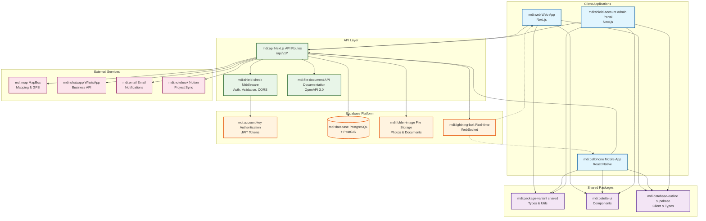
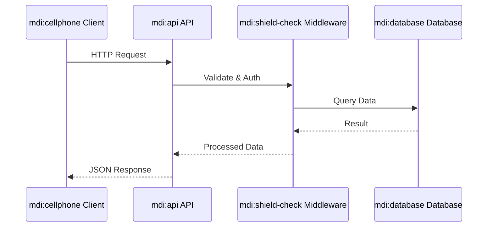
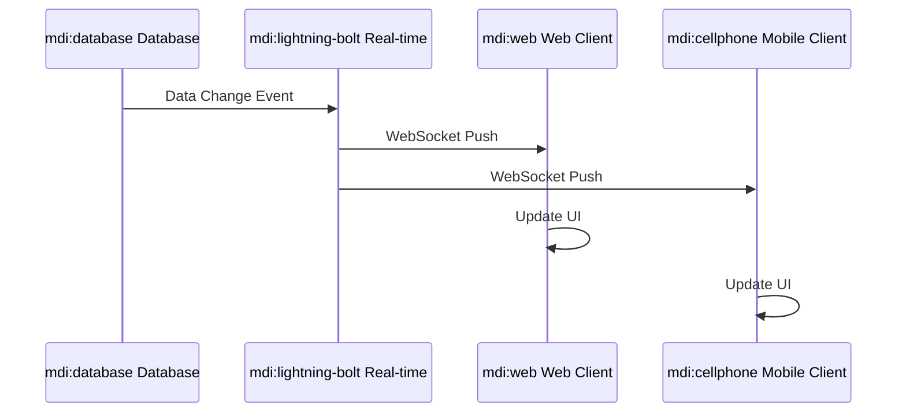
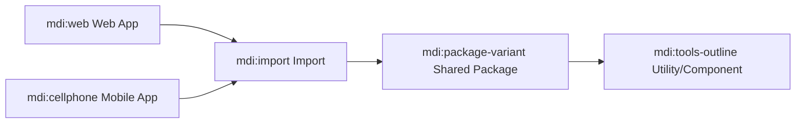

# 🏗️ ConstructTrack System Architecture Diagram

> **Visual representation of the ConstructTrack system architecture**

This document contains the Mermaid diagram for the ConstructTrack system architecture. You can view
this diagram in any Markdown viewer that supports Mermaid (like GitHub, GitLab, or VS Code with
Mermaid extension).

## System Architecture Overview

## Component Descriptions

### Client Applications (Blue)

- **Web App**: Next.js-based management dashboard for project oversight
- **Mobile App**: React Native field worker application with offline capabilities
- **Admin Portal**: System administration and configuration interface

### Shared Packages (Purple)

- **shared**: Common utilities, types, and constants used across applications
- **ui**: Reusable React components with consistent styling
- **supabase**: Database client configuration and type definitions

### API Layer (Green)

- **API Routes**: RESTful endpoints following OpenAPI 3.0 specification
- **Middleware**: Authentication, validation, CORS, and rate limiting
- **Documentation**: Interactive API documentation viewer

### Supabase Platform (Orange)

- **Authentication**: JWT-based auth with role-based access control
- **Database**: PostgreSQL with PostGIS for geospatial data
- **Storage**: File storage for photos and documents
- **Real-time**: WebSocket subscriptions for live updates

### External Services (Pink)

- **MapBox**: Interactive mapping and geospatial services
- **WhatsApp**: Business API for communication workflows
- **Email**: Notification and communication services
- **Notion**: Project management integration and sync

## Data Flow Patterns

### Synchronous API Calls

### Real-time Updates

### Shared Package Usage

## Viewing Instructions

To view this diagram:

1. **GitHub/GitLab**: The diagram will render automatically in the web interface
2. **VS Code**: Install the "Mermaid Markdown Syntax Highlighting" extension
3. **Local Markdown Viewer**: Use any viewer that supports Mermaid syntax
4. **Mermaid Live Editor**: Copy the diagram code to https://mermaid.live/

## Maintenance

When updating the architecture:

1. Update this diagram to reflect changes
2. Update the corresponding documentation in `system-overview.md`
3. Update the Architecture Decision Records if needed
4. Ensure the diagram stays in sync with the actual implementation

---

**Related Documents**:

- [System Overview](system-overview.md)
- [Technical Architecture](technical-architecture.md)
- [Architecture Decisions](architecture-decisions.md)
