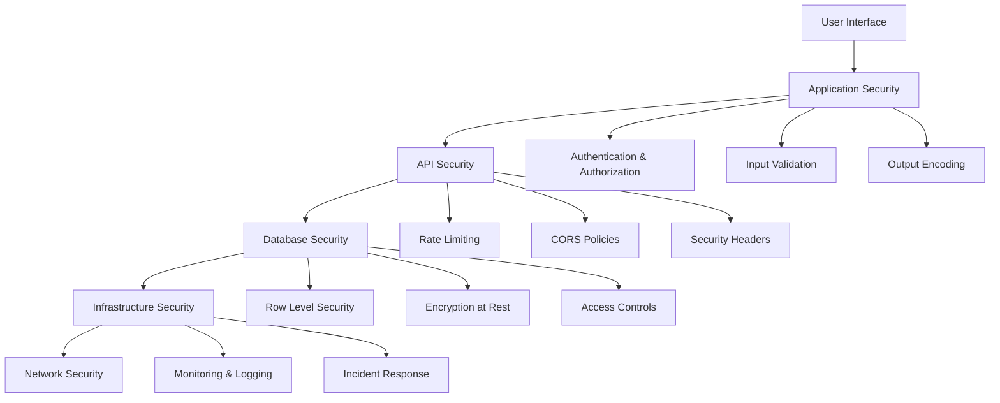
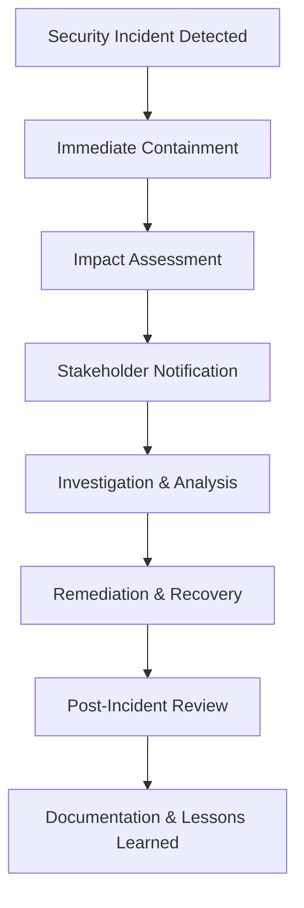

# 🛡️ ConstructTrack Security Guidelines

## Overview

This document outlines the comprehensive security guidelines and best practices for the ConstructTrack fiber optic construction management application. These guidelines ensure the protection of sensitive customer data, compliance with industry regulations, and maintenance of system integrity.

## 🔐 Security Architecture

### Core Security Principles

1. **Defense in Depth**: Multiple layers of security controls
2. **Least Privilege**: Minimal access rights for users and systems
3. **Zero Trust**: Never trust, always verify
4. **Security by Design**: Security built into every component
5. **Data Minimization**: Collect and store only necessary data

### Security Layers



## 🔒 Authentication & Authorization

### Authentication Requirements

- **Multi-Factor Authentication (MFA)**: Required for all admin accounts
- **Strong Password Policy**: Minimum 12 characters, complexity requirements
- **Session Management**: Secure session tokens with proper expiration
- **Account Lockout**: Protection against brute force attacks

### Authorization Model

```typescript
// Role-based access control hierarchy
enum UserRole {
  SUPER_ADMIN = 'super_admin',
  ORG_ADMIN = 'org_admin',
  PROJECT_MANAGER = 'project_manager',
  FIELD_SUPERVISOR = 'field_supervisor',
  FIELD_WORKER = 'field_worker',
  CUSTOMER = 'customer',
  READONLY = 'readonly'
}

// Permission matrix
const PERMISSIONS = {
  [UserRole.SUPER_ADMIN]: ['*'], // All permissions
  [UserRole.ORG_ADMIN]: ['org:*', 'project:*', 'user:*'],
  [UserRole.PROJECT_MANAGER]: ['project:read', 'project:write', 'task:*'],
  [UserRole.FIELD_SUPERVISOR]: ['project:read', 'task:*', 'report:*'],
  [UserRole.FIELD_WORKER]: ['task:read', 'task:update', 'report:create'],
  [UserRole.CUSTOMER]: ['project:read', 'report:read'],
  [UserRole.READONLY]: ['project:read', 'task:read']
};
```

## 🛡️ Data Protection

### Data Classification

| Classification | Description | Examples | Protection Level |
|---------------|-------------|----------|------------------|
| **Public** | Information intended for public access | Marketing materials | Basic |
| **Internal** | Information for internal use only | Project plans, schedules | Standard |
| **Confidential** | Sensitive business information | Customer contracts, pricing | High |
| **Restricted** | Highly sensitive information | Personal data, financial records | Maximum |

### Encryption Standards

- **Data in Transit**: TLS 1.3 minimum
- **Data at Rest**: AES-256 encryption
- **Key Management**: Hardware Security Modules (HSM) or cloud KMS
- **Database**: Transparent Data Encryption (TDE)

### Personal Data Handling

```typescript
// Data privacy compliance implementation
interface PersonalDataRecord {
  dataSubject: string;
  dataCategory: DataCategory;
  processingPurpose: ProcessingPurpose;
  legalBasis: string;
  retentionPeriod: number;
  consentStatus?: ConsentStatus;
}

// GDPR compliance requirements
const GDPR_REQUIREMENTS = {
  consentManagement: true,
  dataPortability: true,
  rightToErasure: true,
  dataProtectionOfficer: true,
  privacyByDesign: true,
  breachNotification: '72 hours'
};
```

## 🔍 Input Validation & Output Encoding

### Input Validation Rules

1. **Whitelist Validation**: Accept only known good input
2. **Length Limits**: Enforce maximum input lengths
3. **Type Validation**: Ensure correct data types
4. **Format Validation**: Use regex for structured data
5. **Business Logic Validation**: Validate against business rules

### Common Validation Patterns

```typescript
// Validation schemas
const ValidationSchemas = {
  email: /^[^\s@]+@[^\s@]+\.[^\s@]+$/,
  phone: /^\+?[\d\s\-\(\)]{10,}$/,
  coordinates: /^-?([1-8]?\d(\.\d+)?|90(\.0+)?),\s*-?(180(\.0+)?|((1[0-7]\d)|([1-9]?\d))(\.\d+)?)$/,
  projectId: /^[a-zA-Z0-9\-_]{8,32}$/,
  userId: /^[0-9a-f]{8}-[0-9a-f]{4}-4[0-9a-f]{3}-[89ab][0-9a-f]{3}-[0-9a-f]{12}$/
};

// Sanitization functions
const sanitize = {
  html: (input: string) => input.replace(/<[^>]*>/g, ''),
  sql: (input: string) => input.replace(/['";\\]/g, ''),
  filename: (input: string) => input.replace(/[^a-zA-Z0-9\-_.]/g, '')
};
```

## 🌐 API Security

### Security Headers

```typescript
// Required security headers
const SECURITY_HEADERS = {
  'Strict-Transport-Security': 'max-age=31536000; includeSubDomains; preload',
  // Prefer nonces or hashes for inline scripts to retain strict CSP
  'Content-Security-Policy':
    "default-src 'self'; script-src 'self' 'strict-dynamic'; object-src 'none'; base-uri 'none'",
  'X-Frame-Options': 'DENY',
  'X-Content-Type-Options': 'nosniff',
  'Referrer-Policy': 'strict-origin-when-cross-origin',
  'Permissions-Policy': 'camera=self, microphone=self, geolocation=self'
};
```

### Rate Limiting Configuration

```typescript
// Rate limiting rules
const RATE_LIMITS = {
  authentication: { windowMs: 15 * 60 * 1000, maxRequests: 5 },
  api: { windowMs: 15 * 60 * 1000, maxRequests: 100 },
  upload: { windowMs: 60 * 1000, maxRequests: 10 },
  search: { windowMs: 60 * 1000, maxRequests: 30 },
  admin: { windowMs: 5 * 60 * 1000, maxRequests: 20 }
};
```

## 🗄️ Database Security

### Supabase Security Configuration

```sql
-- Row Level Security (RLS) policies
CREATE POLICY "Users can only access their organization's data"
ON projects FOR ALL
USING (organization_id = auth.jwt() ->> 'organization_id');

CREATE POLICY "Field workers can only update assigned tasks"
ON tasks FOR UPDATE
USING (
  assigned_to = auth.uid() AND
  status IN ('in_progress', 'pending')
);

-- Audit logging
CREATE TABLE audit_log (
  id UUID PRIMARY KEY DEFAULT gen_random_uuid(),
  table_name TEXT NOT NULL,
  operation TEXT NOT NULL,
  old_data JSONB,
  new_data JSONB,
  user_id UUID REFERENCES auth.users(id),
  timestamp TIMESTAMPTZ DEFAULT NOW()
);
```

## 📱 Mobile Security

### Field Worker App Security

1. **Device Security**
   - Device encryption required
   - Biometric authentication
   - Remote wipe capability
   - App pinning for kiosk mode

2. **Data Protection**
   - Local data encryption
   - Secure offline storage
   - Automatic data sync
   - Cache expiration

3. **Network Security**
   - Certificate pinning
   - VPN support
   - Offline mode security
   - Secure communication protocols

## 🔐 Secrets Management

### Environment Variables

```bash
# Production environment variables
NODE_ENV=production
DATABASE_URL=postgresql://...
JWT_SECRET=<32-character-random-string>
ENCRYPTION_KEY=<32-character-random-string>
SUPABASE_SERVICE_KEY=<service-key>
MAPBOX_ACCESS_TOKEN=<access-token>

# Security configuration
ENABLE_RATE_LIMITING=true
ENABLE_SECURITY_HEADERS=true
ENABLE_AUDIT_LOGGING=true
SESSION_TIMEOUT=3600
```

### Key Rotation Policy

- **JWT Secrets**: Rotate every 90 days
- **Database Passwords**: Rotate every 60 days
- **API Keys**: Rotate every 180 days
- **Encryption Keys**: Rotate annually

## 🚨 Incident Response

### Security Incident Classification

| Level | Description | Response Time | Escalation |
|-------|-------------|---------------|------------|
| **P0** | Critical security breach | 15 minutes | Immediate |
| **P1** | High impact security issue | 1 hour | Within 2 hours |
| **P2** | Medium impact security issue | 4 hours | Within 8 hours |
| **P3** | Low impact security issue | 24 hours | Within 48 hours |

### Incident Response Workflow



## 📊 Security Monitoring

### Key Security Metrics

1. **Authentication Metrics**
   - Failed login attempts
   - Account lockouts
   - MFA bypass attempts
   - Session anomalies

2. **API Security Metrics**
   - Rate limit violations
   - Suspicious request patterns
   - Error rate spikes
   - Unauthorized access attempts

3. **Data Access Metrics**
   - Privilege escalation attempts
   - Data export activities
   - Unusual data access patterns
   - Cross-organization access attempts

### Alerting Thresholds

```typescript
const SECURITY_ALERTS = {
  failedLogins: { threshold: 5, window: '5m' },
  rateLimitViolations: { threshold: 10, window: '1m' },
  privilegeEscalation: { threshold: 1, window: '1m' },
  dataExfiltration: { threshold: 100, window: '10m' },
  suspiciousActivity: { threshold: 3, window: '15m' }
};
```

## 🧪 Security Testing

### Testing Requirements

1. **Static Application Security Testing (SAST)**
   - Code vulnerability scanning
   - Dependency vulnerability scanning
   - Configuration security scanning

2. **Dynamic Application Security Testing (DAST)**
   - Runtime vulnerability scanning
   - Penetration testing
   - API security testing

3. **Interactive Application Security Testing (IAST)**
   - Real-time vulnerability detection
   - Code coverage analysis
   - Runtime protection

### Security Test Automation

```yaml
# CI/CD Security Pipeline
security_scan:
  stage: security
  script:
    - npm audit --audit-level moderate
    - npm run security:scan
    - npm run security:test
  artifacts:
    reports:
      security: security-report.json
  only:
    - merge_requests
    - main
```

## 📋 Compliance Requirements

### Industry Standards

- **SOC 2 Type II**: Security, availability, processing integrity
- **ISO 27001**: Information security management
- **NIST Cybersecurity Framework**: Identify, protect, detect, respond, recover

### Regulatory Compliance

- **GDPR**: EU data protection regulation
- **CCPA**: California Consumer Privacy Act
- **PIPEDA**: Canadian privacy legislation
- **Industry-specific**: Telecommunications regulations

## 🔄 Security Maintenance

### Regular Security Tasks

| Task | Frequency | Responsibility |
|------|-----------|----------------|
| Security patch updates | Weekly | DevOps |
| Vulnerability scanning | Daily | Security Team |
| Access review | Monthly | Security Team |
| Penetration testing | Quarterly | External Vendor |
| Security training | Quarterly | All Staff |
| Incident response drill | Bi-annually | Security Team |

### Security Metrics Dashboard

```typescript
interface SecurityMetrics {
  vulnerabilities: {
    critical: number;
    high: number;
    medium: number;
    low: number;
  };
  compliance: {
    gdprCompliance: number; // percentage
    securityTraining: number; // percentage
    patchLevel: number; // percentage
  };
  incidents: {
    total: number;
    resolved: number;
    averageResolutionTime: number; // hours
  };
}
```

## 📞 Security Contacts

### Emergency Contacts

- **Security Team Lead**: security-lead@constructtrack.com
- **Incident Response**: incident-response@constructtrack.com
- **Data Protection Officer**: dpo@constructtrack.com
- **24/7 Security Hotline**: +1-XXX-XXX-XXXX

### Reporting Security Issues

1. **Internal Issues**: Use internal security portal
2. **External Reports**: security@constructtrack.com
3. **Bug Bounty**: bugbounty@constructtrack.com
4. **Anonymous Reports**: Use secure anonymous portal

---

**Document Version**: 1.0  
**Last Updated**: 2024-01-XX  
**Next Review**: 2024-04-XX  
**Owner**: Security Team  
**Approved By**: CTO, CISO
